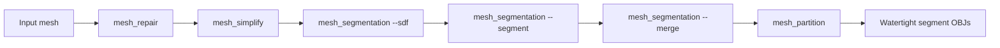

# neuromesh-cgal

C++ mesh processing tools using CGAL for repair, simplification, SDF-based segmentation, label merging, and watertight mesh partitioning. Defaults are tuned on the bundled neuron cell morphology mesh (~330k faces, ~90 merged partitions with conservative merging), but every important parameter is exposed via CLI flags.

## Prerequisites

- CMake 3.20 or higher
- CGAL 6.x
- Eigen3 3.2 or higher
- C++17 compiler

### Ubuntu / WSL

```bash
sudo apt-get update
sudo apt-get install libcgal-dev libeigen3-dev cmake build-essential
```

### Windows (vcpkg)

```bash
vcpkg install cgal eigen3
cmake -B build -DCMAKE_TOOLCHAIN_FILE=[vcpkg-root]/scripts/buildsystems/vcpkg.cmake
cmake --build build --config Release
```

## Building

```bash
mkdir build && cd build
cmake ..
cmake --build . --config Release
```

Executables: `mesh_repair`, `mesh_simplify`, `mesh_segmentation`, `mesh_partition`.

## Pipeline overview



**Full cell morphology example:**

```bash
./build/mesh_repair \
  --input data/cell.obj --output data/cell_repaired.obj

./build/mesh_simplify \
  --input data/cell_repaired.obj --output data/cell_simp.obj --fraction 0.5

./build/mesh_segmentation --sdf \
  --input data/cell_simp.obj --output-prefix data/output/cell

./build/mesh_segmentation --segment \
  --input data/output/cell.obj --output-prefix data/output/cell_segmented \
  --sdf-file data/output/cell.sdf

./build/mesh_segmentation --merge \
  --input data/output/cell_segmented.obj --output-prefix data/output/cell_merged \
  --seg-file data/output/cell_segmented.seg --sdf-file data/output/cell.sdf

./build/mesh_partition \
  --input data/output/cell_merged.obj --output-dir data/output/cell_merged_parts/ \
  --seg-file data/output/cell_merged.seg
```

Run `mesh_repair` first for best segmentation results (watertight input).

## Sidecar file formats

| File | Description |
|------|-------------|
| `.sdf` | One SDF value per face (`# neuromesh-sdf v1`, then `faces N`, then N lines) |
| `.seg` | One segment ID per face (`# neuromesh-seg v1`, same layout) |
| `*_merge_log.txt` | Merge statistics and per-operation log |
| `partition_log.txt` | Per-segment partition stats in output directory |

Sidecar face order matches `mesh.faces()` iteration order in the written mesh. If you simplify or repair after writing a sidecar, recompute it.

## Tool reference

All tools use `--help` for usage. Positional arguments are **not supported** (use `--input`, `--output`, etc.).

### mesh_repair

Repairs meshes: stitch borders, fix non-manifold vertices, keep largest component(s), detect self-intersections, fill holes, remove degenerates.

```bash
mesh_repair --input data/in.obj --output data/out.obj [options]
```

| Flag | Default | Description |
|------|---------|-------------|
| `--input` | required | Input mesh path |
| `--output` | required | Output mesh path |
| `--keep-components` | `1` | Number of largest connected components to keep |
| `--no-stitch-borders` | off | Skip duplicate boundary stitching |
| `--no-fix-nonmanifold` | off | Skip non-manifold vertex repair |
| `--no-fill-holes` | off | Skip boundary hole filling |
| `--continue-on-self-intersections` | off | Exit 0 even if self-intersections remain |
| `--help` | | Show usage |

### mesh_simplify

Edge-collapse simplification to a target edge count or fraction.

```bash
mesh_simplify --input data/in.obj --output data/out.obj --fraction 0.5
mesh_simplify --input data/in.obj --output data/out.obj --edge-count 1000
```

| Flag | Default | Description |
|------|---------|-------------|
| `--input` | required | Input mesh path |
| `--output` | required | Output mesh path |
| `--fraction` | — | Keep this fraction of edges (0–1); exclusive with `--edge-count` |
| `--edge-count` | — | Target edge count (≥1); exclusive with `--fraction` |
| `--help` | | Show usage |

### mesh_segmentation

Three phases: SDF computation, graph-cut segmentation, SDF-aware label merge.

```bash
mesh_segmentation --sdf     --input M --output-prefix P [options]
mesh_segmentation --segment --input M --output-prefix P [options]
mesh_segmentation --merge   --input M --output-prefix P [options]
```

**Common flags**

| Flag | Default | Description |
|------|---------|-------------|
| `--input` | required | Input mesh |
| `--output-prefix` | required | Output prefix (writes `.obj`, sidecars, `.ply`) |
| `--help` | | Show usage |

**SDF phase (`--sdf`)**

| Flag | Default | Description |
|------|---------|-------------|
| `--rays` | `25` | Rays cast per face for SDF |
| `--cone-angle` | `2π/3` rad | Ray cone angle |
| `--no-postprocess` | off | Disable CGAL SDF postprocessing |

**Segment phase (`--segment`)**

| Flag | Default | Description |
|------|---------|-------------|
| `--sdf-file` | `<input_basename>.sdf` | SDF sidecar path |
| `--clusters` | `3` | Soft-cluster count for graph-cut seeds |
| `--lambda` | `0.22` | Cut smoothness (0–1; higher = fewer small islands) |

**Merge phase (`--merge`)**

| Flag | Default | Description |
|------|---------|-------------|
| `--seg-file` | `<input_basename>.seg` | Input segment labels |
| `--sdf-file` | `<input_basename>.sdf` | SDF sidecar for thickness stats |
| `--min-faces` | `30` | Merge artifact islands below this face count |
| `--min-spine-faces` | `10` | Minimum faces to preserve a terminal thin spine |
| `--bridge-max-faces` | `250` | Merge neck/bridge slivers below this size |
| `--spine-sdf-percentile` | `80` | Preserve leaf segments thinner than this SDF percentile |
| `--max-passes` | `64` | Union-find merge iteration limit |
| `--soma-id` | auto | Override soma segment (default: largest segment) |

### mesh_partition

Extracts one watertight OBJ per segment label; caps cut boundaries with identical interface vertex positions across adjacent parts.

```bash
mesh_partition --input data/merged.obj --output-dir data/parts/ [options]
```

| Flag | Default | Description |
|------|---------|-------------|
| `--input` | required | Segmented mesh |
| `--output-dir` | required | Output directory for `segment_NNN.obj` |
| `--seg-file` | `<input_basename>.seg` | Segment label sidecar |
| `--allow-open` | off | Allow open input (warn instead of abort) |
| `--min-output-faces` | `0` | Skip writing segments with fewer faces |
| `--filename-width` | auto | Zero-pad width for filenames (minimum 3) |
| `--help` | | Show usage |

## Tuning guide

Defaults lean toward **more partitions** (less aggressive merging). If you still have too few parts, decrease `--bridge-max-faces`, raise `--spine-sdf-percentile`, or lower `--lambda` in the segment phase.

### Too many partitions after merge

- Increase `--lambda` in the segment phase (e.g. `0.3–0.5`) for smoother initial cuts
- Increase `--bridge-max-faces` to merge more neck slivers
- Lower `--spine-sdf-percentile` to merge more thin leaves
- Increase `--min-faces` to absorb more tiny artifact islands

### Too few partitions after merge

- Decrease `--bridge-max-faces` (e.g. `150`)
- Raise `--spine-sdf-percentile` (e.g. `85`)
- Lower `--min-faces` (e.g. `20`) to merge fewer tiny islands
- Lower `--lambda` (e.g. `0.18`) for finer initial graph-cut boundaries

### Generic meshes vs neuron morphology

Neuron defaults assume thin spines and a large soma. For non-neuron meshes, start with `--clusters 4–8`, `--lambda 0.3`, and disable or relax merge thresholds. Inspect colored `.ply` output before partitioning.

Defaults live in [`src/defaults.hpp`](src/defaults.hpp).

## Migration from positional CLI

| Old | New |
|-----|-----|
| `mesh_repair in.obj out.obj` | `mesh_repair --input in.obj --output out.obj` |
| `mesh_simplify in.obj out.obj 0.5` | `mesh_simplify --input in.obj --output out.obj --fraction 0.5` |
| `mesh_segmentation --sdf in out` | `mesh_segmentation --sdf --input in --output-prefix out` |
| `mesh_partition in.obj parts/` | `mesh_partition --input in.obj --output-dir parts/` |

## Not yet implemented

`mesh_smooth` and `mesh_remesh` are described in older notes but are not built in this repository.

## Project structure

```
neuromesh-cgal/
├── src/
│   ├── cli_common.hpp        # Shared CLI helpers
│   ├── defaults.hpp          # Default parameter values
│   ├── mesh_repair.cpp
│   ├── mesh_simplify.cpp
│   ├── mesh_segmentation.cpp
│   ├── segment_merge.hpp
│   └── mesh_partition.cpp
├── docs/                     # CGAL reference and repair strategy
├── data/                     # Example meshes and outputs
└── CMakeLists.txt
```

## Adding new operations

1. Add a `.cpp` in `src/` and include `defaults.hpp` / `cli_common.hpp` as needed
2. Register in `CMakeLists.txt` with `CGAL::CGAL` and `Eigen3::Eigen`
3. Document all flags in this README
